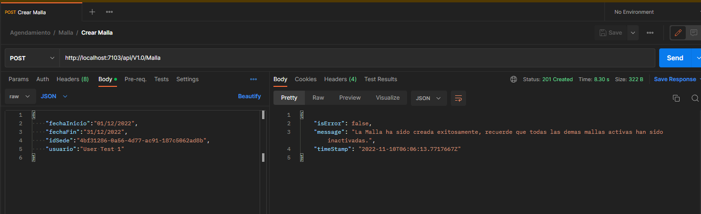
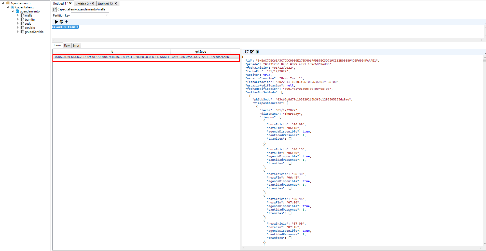
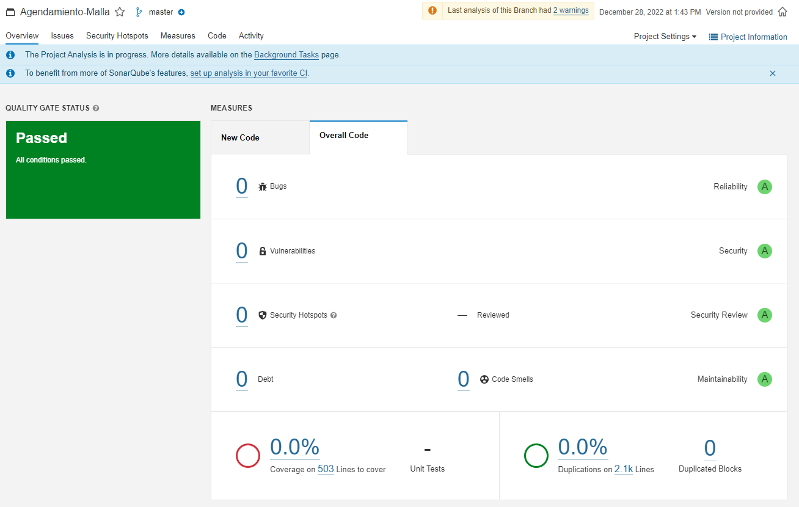
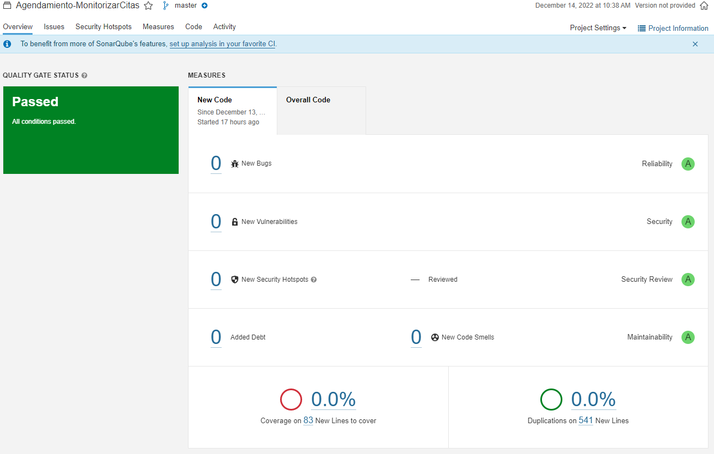
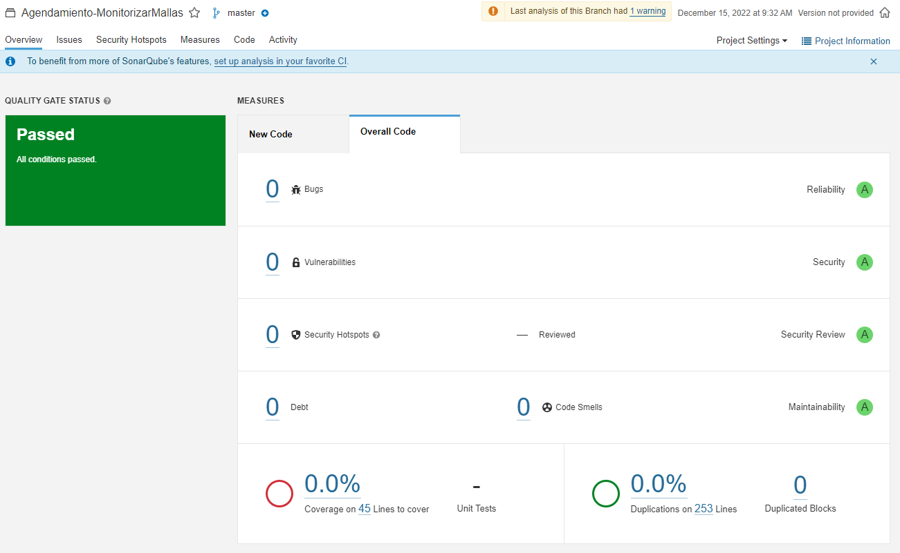

# GESTIÓN DE MALLAS

Desarrollo para la creación y gestion de mallas en agendamiento.

# End points

#RESULTADO ANALISIS DE CODIGO

# PROCESOS BATCH AGENDAMIENTO 
Procesos que necesitan correr en un hora determinada, y no dependen de una interacción del usuario.

# MONITORIZAR CITAS
**Función del Proyecto:** Proceso batch que se encarga de monitorizar que citas no se han cumplido y le agrega el estado NO ASISTIDO y la inhabilita.

**Análisis de Sonar Cloud.**

# MONITORIZAR MALLAS

**Función del Proyecto:** Proceso batch que se encarga de monitorizar que mallas han caducado para inhabilitarlas.
Análisis de Sonar Cloud.

**Análisis de Sonar Cloud.**

